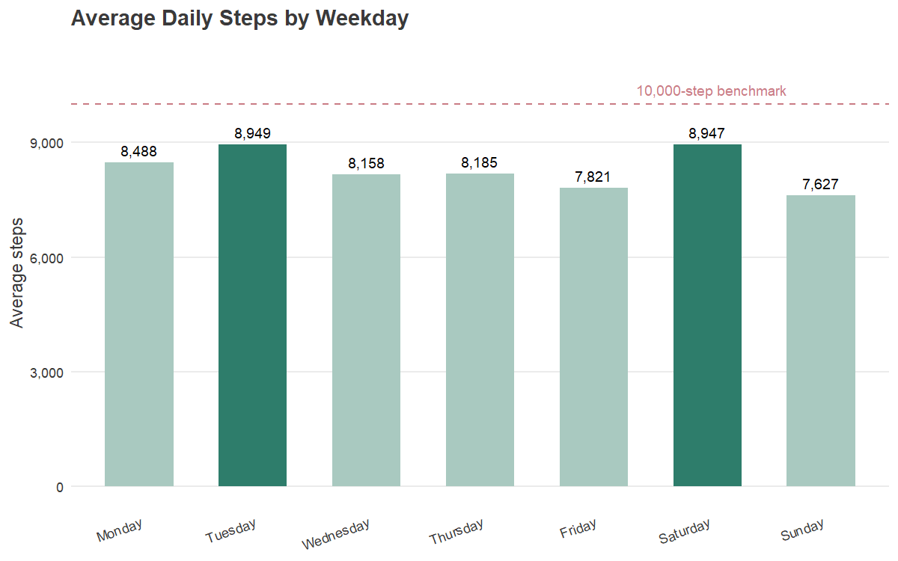
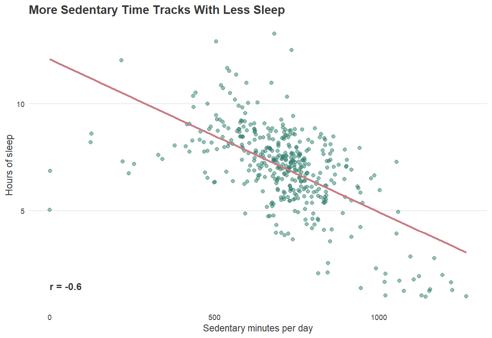
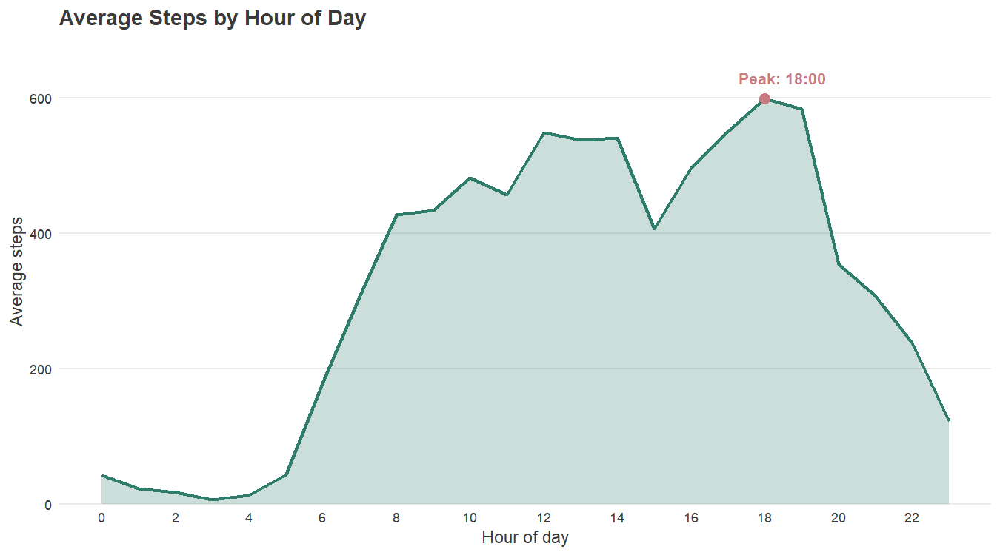

# Phase 5: Share

## Audience & Approach

The audience is the Bellabeat executive team, who need high-level, decision-ready insight. Each visualization below is built around a single takeaway, with the supporting number directly on the chart so it stands on its own.

## Activity Is Inconsistent Across the Week

Steps peak on Tuesday and again on Saturday, both essentially tying at just under 9,000 steps/day, while Sunday is the lowest day at approximately 7,600 steps. No day, on average, clears the general 10,000-step benchmark. Users aren't consistently active and even the peak days fall short of common activity guidelines.

## Sedentary Time Is More Predictive of Poor Sleep Than Activity Level

This is the strongest relationship in the dataset; the more sedentary minutes someone logs in a day, the less they sleep that night. Total steps, by contrast, barely correlated with sleep, so it's inactivity, not exercise volume, that tracks with worse sleep. Reducing sedentary time may be a more effective lever for improving sleep than pushing users to hit a step count.

## Activity Peaks in the Early Evening

Step counts climb steadily through the day and peak at 6 PM, consistent with an after-work activity window, with a smaller midday bump around lunch hours. Early evening is the highest-engagement window for activity, which makes it a natural moment for reminders, prompts, or content tied to movement.

## Summary

Together, these findings point to a user base that is inconsistently active across the week, often sedentary in ways that measurably hurt their sleep, and most physically active in a predictable early-evening window. These patterns directly inform the marketing recommendations in the Act phase.
